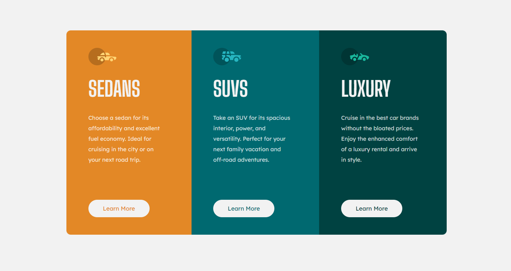

# Frontend Mentor - 3-column preview card component solution

This is a solution to the [3-column preview card component challenge on Frontend Mentor](https://www.frontendmentor.io/challenges/3column-preview-card-component-pH92eAR2-). Frontend Mentor challenges help you improve your coding skills by building realistic projects.

## Table of contents

- [Overview](#overview)
  - [The challenge](#the-challenge)
  - [Screenshot](#screenshot)
  - [Links](#links)
- [My process](#my-process)
  - [Built with](#built-with)
  - [What I learned](#what-i-learned)
- [Author](#author)

## Overview

### The challenge

Users should be able to:

- View the optimal layout depending on their device's screen size (desktop or mobile)
- See hover states for interactive elements ("Learn More" Buttons)

### Screenshot



### Links

- Solution URL: [https://www.frontendmentor.io/solutions/3-column-preview-card-component-html-css-flexbox-mobile-first-6ThlLqkiRk](https://www.frontendmentor.io/solutions/3-column-preview-card-component-html-css-flexbox-mobile-first-6ThlLqkiRk)
- Live Site URL: [https://andres-av.github.io/3-column-preview-card-component/](https://andres-av.github.io/3-column-preview-card-component/)

## My process

### Built with

- Semantic HTML5 markup
- CSS custom properties
- Flexbox
- Mobile-first workflow

### What I learned

I challenged myself to be pixel perfect while resolving this challenge, therefore the one of the difficulties I encounter was to adjust padding, margins and text size perfectly. Specially while adjusting the text, I wanted my paragraphs lines to break at the same words as the example in both, mobile and desktop layouts.

It also called my attention that the css is a little longer than what I expected it to be. I don't know if there could be ways for improving this and making it shorter/simpler and more maintainable (I guess I would have to rely on react to make components in order to avoid writing too much css on the same stylesheet).

Specially some areas like the following, where I had to add extra css declarations just to make minimal changes:

1. I declared the individual card element, then gave the border radius to the first child in case later one we want to add other cards at beginning or end, and then declared the color of each card

```css
.card {
  padding: 40px 40px 40px 50px;
  display: flex;
  flex-direction: column;
  justify-content: space-between;
}
.card:first-child {
  border-radius: 10px 10px 0px 0px;
}
.card:last-child {
  border-radius: 0px 0px 10px 10px;
}
.sedan {
  background-color: hsl(31, 77%, 52%);
}
.suvs {
  background-color: hsl(184, 100%, 22%);
}
.luxury {
  background-color: hsl(179, 100%, 13%);
}
```

2. Or with the Learn More button, where I declared the button, gave the hover properties, then I had to declare the colors for each one of them according to the hover behavior and the card they were on.

```css
.ctaBtn {
  background-color: hsl(0, 0%, 95%);
  border: solid 2px hsl(0, 0%, 95%);
  width: 140px;
  padding: 10px 0px;
  border-radius: 25px;
  font-family: "Lexend Deca", sans-serif;
  margin-top: 20px;
}
.ctaBtn:hover {
  color: hsl(0, 0%, 95%);
  border: solid 2px hsl(0, 0%, 95%);
  cursor: pointer;
}
.ctaSedan {
  color: hsl(31, 77%, 52%);
}
.ctaSedan:hover {
  background-color: hsl(31, 77%, 52%);
}
.ctaSuvs {
  color: hsl(184, 100%, 22%);
}
.ctaSuvs:hover {
  background-color: hsl(184, 100%, 22%);
}
.ctaLuxury {
  color: hsl(179, 100%, 13%);
}
.ctaLuxury:hover {
  background-color: hsl(179, 100%, 13%);
}
```

## Author

- Linkedin - [Andres Abarca](www.linkedin.com/in/andres-abarca)
- Frontend Mentor - [@andres-av](https://www.frontendmentor.io/profile/andres-av)
- GitHub - [andres-av](https://github.com/andres-av)
